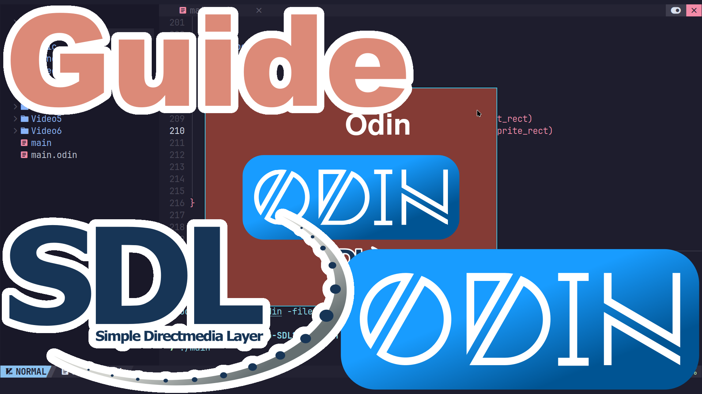

# An in-depth guide to getting started with SDL2 in the Go Language.
https://www.youtube.com/playlist?list=PLO02jwa2ZaiDY7kVImqZUHDiuomsl7OdA

## Build and Run
You will need Odin installed.
```
cd
git clone https://aur.archlinux.org/odin.git
cd odin
makepkg -i
```
Build and Run.
```
cd
git clone https://github.com/ProgrammingRainbow/Beginners-Guide-to-SDL2-in-Odin
cd Beginners-Guide-to-SDL2-in-Odin
odin run main.odin -file
```
## Controls
Escape - Close. \
Space - Change Background color and play Odin Sound. \
m - Toggle Music.
